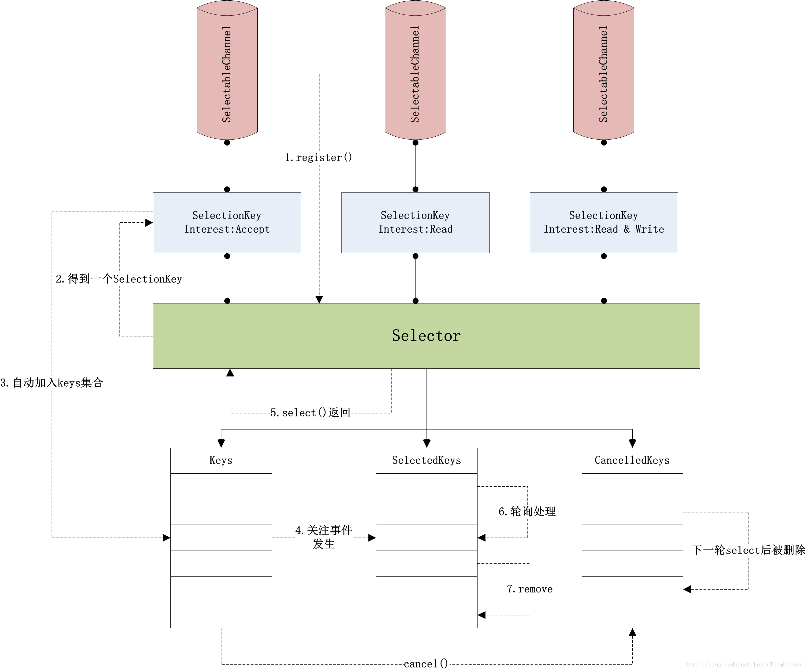

[TOC]

# 一、FileChannel

## 1、利用缓冲区
``` java
    @Test
    public void test1() throws Exception {
        FileInputStream fis = new FileInputStream("D:\\in.txt");
        FileOutputStream fos = new FileOutputStream("D:\\out.txt");
        FileChannel inChannel = fis.getChannel();
        FileChannel outChannel = fos.getChannel();
        ByteBuffer buf = ByteBuffer.allocate(1024);//非直接缓冲区
        //ByteBuffer buf = ByteBuffer.allocateDirect(1024);//直接缓冲区

        while (inChannel.read(buf) > 0) {
            buf.flip();
            outChannel.write(buf);
            buf.clear();
        }

        fis.close();
        fos.close();
        inChannel.close();
        outChannel.close();
    }
```
``` java
    @Test
    public void test2() throws Exception {
        RandomAccessFile ras = new RandomAccessFile("D:\\in.txt", "rw");
        RandomAccessFile ras2 = new RandomAccessFile("D:\\out.txt", "rw");

        FileChannel inChannel = ras.getChannel();
        FileChannel outChannel = ras2.getChannel();

        ByteBuffer buf = ByteBuffer.allocate(1024);//非直接缓冲区
        //ByteBuffer buf = ByteBuffer.allocateDirect(1024);//直接缓冲区

        while (inChannel.read(buf) > 0) {
            buf.flip();
            outChannel.write(buf);
            buf.clear();
        }

        ras.close();
        ras2.close();

        inChannel.close();
        outChannel.close();
    }
```
## 2、通道间传输
``` java
    @Test
    public void test3() throws Exception {
        FileChannel inChannel = FileChannel.open(Paths.get("D:\\in.txt"), StandardOpenOption.READ);
        FileChannel outChannel = FileChannel.open(Paths.get("D:\\out.txt"), StandardOpenOption.READ, StandardOpenOption.WRITE, StandardOpenOption.CREATE);

        inChannel.transferTo(0, inChannel.size(), outChannel);
        //outChannel.transferFrom(inChannel, 0, inChannel.size());

        inChannel.close();
        outChannel.close();
    }
```

# 二、MappedByteBuffer
## 1、直接缓冲区、内存映射
``` java
    @Test
    public void test4() throws Exception {
        FileChannel inChannel = FileChannel.open(Paths.get("D:\\in.txt"), StandardOpenOption.READ);
        FileChannel outChannel = FileChannel.open(Paths.get("D:\\out.txt"), StandardOpenOption.READ, StandardOpenOption.WRITE, StandardOpenOption.CREATE);

        long size = inChannel.size();

        MappedByteBuffer inMappedBuf = inChannel.map(FileChannel.MapMode.READ_ONLY, 0, size);
        MappedByteBuffer outMappedBuf = outChannel.map(FileChannel.MapMode.READ_WRITE, 0, size);

        byte[] buf = new byte[1024];
        int length;

        while (inMappedBuf.hasRemaining()) {
            length = inMappedBuf.remaining() > buf.length ? buf.length : inMappedBuf.remaining();
            inMappedBuf.get(buf, 0, length);
            outMappedBuf.put(buf, 0, length);
        }

        inChannel.close();
        outChannel.close();
    }
```

## 2、分散读取(Scatter)与聚集写入(Gather)
``` java
   @Test
    public void test5() throws Exception {
        FileChannel inChannel = FileChannel.open(Paths.get("D:\\in.txt"), StandardOpenOption.READ);
        FileChannel outChannel = FileChannel.open(Paths.get("D:\\out.txt"), StandardOpenOption.READ, StandardOpenOption.WRITE, StandardOpenOption.CREATE);

        ByteBuffer buf1 = ByteBuffer.allocate(100);
        ByteBuffer buf2 = ByteBuffer.allocate(1024);
        ByteBuffer[] bufs = {buf1, buf2};

        inChannel.read(bufs);

        for (ByteBuffer buffer : bufs) {
            buffer.flip();
        }

        outChannel.write(bufs);

        inChannel.close();
        outChannel.close();
    }

    @Test
    public void test6() throws Exception {
        RandomAccessFile ras = new RandomAccessFile("D:\\in.txt", "rw");
        RandomAccessFile ras2 = new RandomAccessFile("D:\\out.txt", "rw");
        FileChannel inChannel = ras.getChannel();
        FileChannel outChannel = ras2.getChannel();

        ByteBuffer buf1 = ByteBuffer.allocate(100);
        ByteBuffer buf2 = ByteBuffer.allocate(1024);
        ByteBuffer[] bufs = {buf1, buf2};

        inChannel.read(bufs);

        for (ByteBuffer buffer : bufs) {
            buffer.flip();
        }

        outChannel.write(bufs);

        ras.close();
        ras2.close();
        inChannel.close();
        outChannel.close();
    }

```

# 三、编码与解码
``` java
    @Test
    public void test7() throws Exception {
        Charset gbk = Charset.forName("GBK");
        Charset utf8 = Charset.forName("UTF-8");

        CharBuffer charBuffer = CharBuffer.allocate(100);
        charBuffer.put("大家好");
        charBuffer.flip();

        //gbk编码
        ByteBuffer byteBuffer = gbk.newEncoder().encode(charBuffer);

        //gbk解码
        CharBuffer buff1 = gbk.newDecoder().decode(byteBuffer);
        System.out.println(buff1.toString());//大家好

        //重读
        byteBuffer.rewind();

        //utf8解码
        CharBuffer buffer = utf8.decode(byteBuffer);
        System.out.println(buffer.toString());//��Һ�
    }
```

# 四、SocketChannel、ServerSocketChannel
阻塞式

``` java
    @Test
    public void client() throws Exception {
        SocketChannel socketChannel = SocketChannel.open(new InetSocketAddress("127.0.0.1", 8888));
        FileChannel fileChannel = FileChannel.open(Paths.get("D:\\a.txt"), StandardOpenOption.READ);

        ByteBuffer buffer = ByteBuffer.allocate(1024);

        while (fileChannel.read(buffer) > 0) {
            buffer.flip();
            socketChannel.write(buffer);
            buffer.clear();
        }

        socketChannel.shutdownOutput();

        int len;
        while ((len = socketChannel.read(buffer)) > 0) {
            System.out.print(new String(buffer.array(), 0, len));
        }

        fileChannel.close();
        socketChannel.close();
    }

    @Test
    public void server() throws Exception {
        ServerSocketChannel serverSocketChannel = ServerSocketChannel.open();
        serverSocketChannel.bind(new InetSocketAddress(8888));

        SocketChannel socketChannel = serverSocketChannel.accept();
        FileChannel fileChannel = FileChannel.open(Paths.get("D:\\b.txt"), StandardOpenOption.WRITE, StandardOpenOption.CREATE);

        ByteBuffer buffer = ByteBuffer.allocate(1024);

        while (socketChannel.read(buffer) > 0) {
            buffer.flip();
            fileChannel.write(buffer);
            buffer.clear();
        }

        buffer.put("服务的接收成功".getBytes());
        buffer.flip();
        socketChannel.write(buffer);
        socketChannel.shutdownOutput();

        fileChannel.close();
        socketChannel.close();
        serverSocketChannel.close();
    }

```
***
# 五、聊天室
``` java
public class NioServer {

    private int port;
    private ByteBuffer buffer = ByteBuffer.allocate(1024);

    public static void main(String[] args) throws IOException {
        new NioServer(8888).start();
    }

    public NioServer(int port) {
        this.port = port;
    }

    public void start() throws IOException {
        ServerSocketChannel serverSocketChannel = ServerSocketChannel.open();
        serverSocketChannel.configureBlocking(false);
        serverSocketChannel.bind(new InetSocketAddress("127.0.0.1", port));

        Selector selector = Selector.open();
        serverSocketChannel.register(selector, SelectionKey.OP_ACCEPT);

        while (true) {
            //自上次调用select()方法后有多少通道变成就绪状态,因为有一个通道变成就绪状态，返回了1，若再次调用select()方法，如果另一个通道就绪了，它会再次返回1。
            //如果对第一个就绪的channel没有做任何操作，现在就有两个就绪的通道，但在每次select()方法调用之间，只有一个通道就绪了。
            //其他线程调用 selector.wakeup() 方法会立即唤醒,可能返回0
            int n = selector.select();
            if (n == 0) {
                continue;
            }

            Iterator<SelectionKey> it = selector.selectedKeys().iterator();
            while (it.hasNext()) {
                SelectionKey sk = it.next();
                //Selector不会自己从已选择键集中移除SelectionKey实例。必须在处理完通道时自己移除。下次该通道变成就绪时，Selector会再次将其放入已选择键集中
                it.remove();

                if (sk.isAcceptable()) {
                    accepteHandler(selector, sk);
                } else if (sk.isReadable()) {
                    readHandler(selector, sk);
                } else if (sk.isWritable()) {
                    writeHandler(sk);
                }
            }
        }
    }

    private void accepteHandler(Selector selector, SelectionKey sk) throws IOException {
        ServerSocketChannel serverSocketChannel = (ServerSocketChannel) sk.channel();
        SocketChannel socketChannel = serverSocketChannel.accept();
        socketChannel.configureBlocking(false);
        socketChannel.register(selector, SelectionKey.OP_READ);
    }

    private void readHandler(Selector selector, SelectionKey sk) throws IOException {
        ByteArrayOutputStream baos = new ByteArrayOutputStream();
        SocketChannel socketChannel = (SocketChannel) sk.channel();
        int n;
        buffer.clear();
        //read返回0有3种情况
        //1、某一时刻socketChannel中当前没有数据可以读
        //2、bytebuffer的remaining等于0(执行clear,不存在这种情况)
        //3、客户端的数据发送完毕了
        while ((n = socketChannel.read(buffer)) > 0) {
            buffer.flip();
            baos.write(buffer.array(), 0, n);
            buffer.clear();
        }
        if (baos.size() > 0) {
            System.out.println(new String(baos.toByteArray()));
            broadcast(selector, sk, baos.toByteArray());
        }
    }

    private void broadcast(Selector selector, SelectionKey sk, byte[] bytes) throws IOException {
        for (SelectionKey key : selector.keys()) {
            if (key.channel() instanceof SocketChannel && key.channel() != sk.channel()) {
                SocketChannel socketChannel = (SocketChannel) key.channel();
                ByteBuffer buffer = ByteBuffer.wrap(bytes);
                int len = socketChannel.write(buffer);
                //write()方法无法保证能写多少字节到SocketChannel。所以重复调用write()直到Buffer没有要写的字节为止
                while (buffer.hasRemaining() && len > 0) {
                    socketChannel.write(buffer);
                }
                //如果缓存区满了,则注册写入事件
                if (buffer.hasRemaining() && len == 0) {
                    sk.attach(buffer);
                    socketChannel.register(selector, SelectionKey.OP_WRITE);
                }
            }
        }
    }

    private void writeHandler(SelectionKey sk) throws IOException {
        SocketChannel socketChannel = (SocketChannel) sk.channel();
        ByteBuffer buffer = (ByteBuffer) sk.attachment();
        if (buffer != null) {
            while (buffer.hasRemaining()) {
                socketChannel.write(buffer);
            }
        }
        //取消注册写入事件
        sk.interestOps(sk.interestOps() & ~SelectionKey.OP_WRITE);
    }
}

```
``` java
public class NioClient {

    private String nickname;

    public NioClient(String nickname) {
        this.nickname = nickname;
    }

    public void start() throws IOException {
        SocketChannel socketChannel = SocketChannel.open();
        socketChannel.configureBlocking(false);

        Selector selector = Selector.open();
        SelectionKey sk = socketChannel.register(selector, SelectionKey.OP_CONNECT);
        socketChannel.connect(new InetSocketAddress("127.0.0.1", 8888));

        new Thread(new ClientHandle(selector)).start();

        Scanner scanner = new Scanner(System.in);
        Charset charset = Charset.forName("UTF-8");

        while (scanner.hasNext()) {
            String msg = scanner.nextLine();
            ByteBuffer buffer = charset.encode(nickname + ":" + msg);
            int len = socketChannel.write(buffer);
            while (buffer.hasRemaining() && len > 0) {
                socketChannel.write(buffer);
            }
            if (buffer.hasRemaining() && len == 0) {
                sk.attach(buffer);
                socketChannel.register(selector, SelectionKey.OP_WRITE);
            }
        }
    }

    static class ClientHandle implements Runnable {
        private ByteBuffer buffer = ByteBuffer.allocate(1024);
        private Selector selector;

        public ClientHandle(Selector selector) {
            this.selector = selector;
        }

        @Override
        public void run() {
            try {
                while (true) {
                    int n = selector.select();
                    if (n == 0) {
                        continue;
                    }

                    Iterator<SelectionKey> it = selector.selectedKeys().iterator();
                    while (it.hasNext()) {
                        SelectionKey sk = it.next();
                        it.remove();

                        if (sk.isConnectable()) {
                            connectHandler(selector, sk);
                        } else if (sk.isReadable()) {
                            readHandler(sk);
                        } else if (sk.isWritable()) {
                            writeHandler(sk);
                        }
                    }
                }
            } catch (IOException e) {
                e.printStackTrace();
            }
        }

        private void connectHandler(Selector selector, SelectionKey sk) throws IOException {
            SocketChannel socketChannel = (SocketChannel) sk.channel();
            if (!socketChannel.isConnected()) {
                socketChannel.finishConnect();
            }
            sk.interestOps(sk.interestOps() & ~SelectionKey.OP_CONNECT);
            socketChannel.register(selector, SelectionKey.OP_READ);
        }

        private void readHandler(SelectionKey sk) throws IOException {
            ByteArrayOutputStream baos = new ByteArrayOutputStream();
            SocketChannel socketChannel = (SocketChannel) sk.channel();
            int n;
            buffer.clear();
            while ((n = socketChannel.read(buffer)) > 0) {
                buffer.flip();
                baos.write(buffer.array(), 0, n);
                buffer.clear();
            }
            if (baos.size() > 0) {
                System.out.println(baos.toString());
            }
        }

        private void writeHandler(SelectionKey sk) throws IOException {
            SocketChannel socketChannel = (SocketChannel) sk.channel();
            ByteBuffer buffer = (ByteBuffer) sk.attachment();
            if (buffer != null) {
                while (buffer.hasRemaining()) {
                    socketChannel.write(buffer);
                }
            }
            sk.interestOps(sk.interestOps() & ~SelectionKey.OP_WRITE);
        }
    }
}
```


# 六、selection




[参考](https://blog.csdn.net/qq_28303495/article/details/89601933)

***