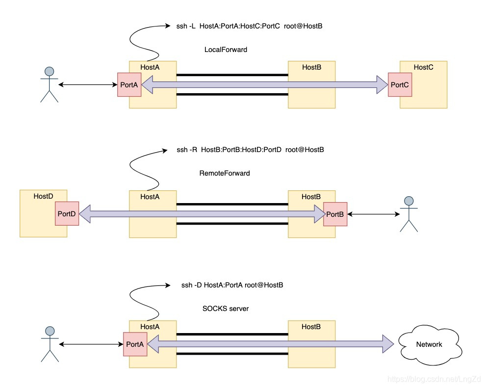

# 一、免密登录

```shell
1、ssh-keygen -t rsa
2、ssh-copy-id host

~/.ssh下文件
    known_hosts	    记录ssh访问过计算机的公钥(public key)
    id_rsa	        生成的私钥
    id_rsa.pub	    生成的公钥
    authorized_keys	存放授权过的无密登录服务器公钥
```


# 二、隧道

## 

## 1、参数

```shell
-C：压缩传输，提升传输速度
-f：将ssh传输转入后台执行，不占用当前的shell
-N：创建静默链接（创建了链接，可是看不到具体的会话）
-g：容许远程主机链接本地用于转发的端口
-L：本地端口转发
-R：远程端口转发
-D：动态转发（socks代理）
-P：指定ssh端口
```


## 2、本地转发（LocalForward）

```shell
ssh -L <listen port>:<remote ip>:<remote port> user@<ssh server> -p <ssh server port>
ssh -L vps端口:目标主机:目标端口 用户@跳板机
ssh -fCNg -L HostA:PortA:HostC:PortC root@HostB
```

```shell
ssh -fCNg -L HostA:PortA:HostC:PortC root@HostB

访问本地机器HostA:PortA的流量，会通过中间机器B转发到远程机器HostC:PortC上。在这里，需要ssh登录到HostB
```


## 3、远程代理（RemoteForward）

```shell
ssh -R <listen port>:<remote ip>:<remote port> user@<SSH server> -p <ssh server port>
ssh -R vps端口:目标主机:目标端口 用户@跳板机
```

```shell
ssh -fCNg -R HostB:PortB:HostD:PortD root@HostB

本地机器为HostA，在本地机器通过ssh登录远程机器HostB，建立一条通信隧道
访问远程机器HostB:PortB的流量会通过HostA转发到HostD:PortD
```


## 4、动态转发

```shell
ssh -fCNg -D HostA:PortA root@HostB

本地机器为HostA，在本地机器上ssh登录到HostB，建立通信隧道。本地机器的HostA:PortA成为代理端口
流量通过HostB转发出去，流量到达目的机器后，目的机器看到流量的源地址为HostB。
```


## 5、X协议转发

```shell
ssh -X root@host -p port

能够使用远程主机的图像化工具
```


## 6、总结

1）、本地机器不能访问远程机器，中间机器可以访问远程机器，本地机器可以ssh登录到中间机器，这种情况下可以使用本地转发。

2）、两个远程机器不能相互访问，但本地机器可以访问这两个远程机器，这个情况用远程转发。

3）、本地机器可以ssh登录到远程机器，如果想让远程机器变成SOCK4和SOCK5代理服务器，这种情况可以使用动态端口转发。